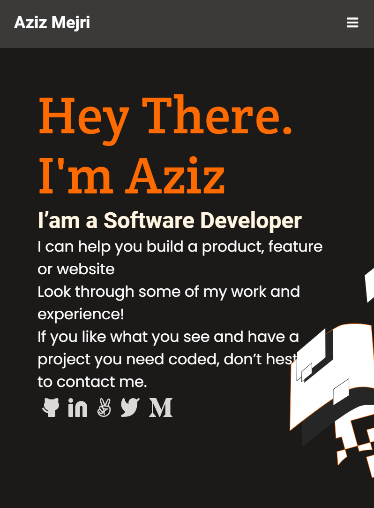
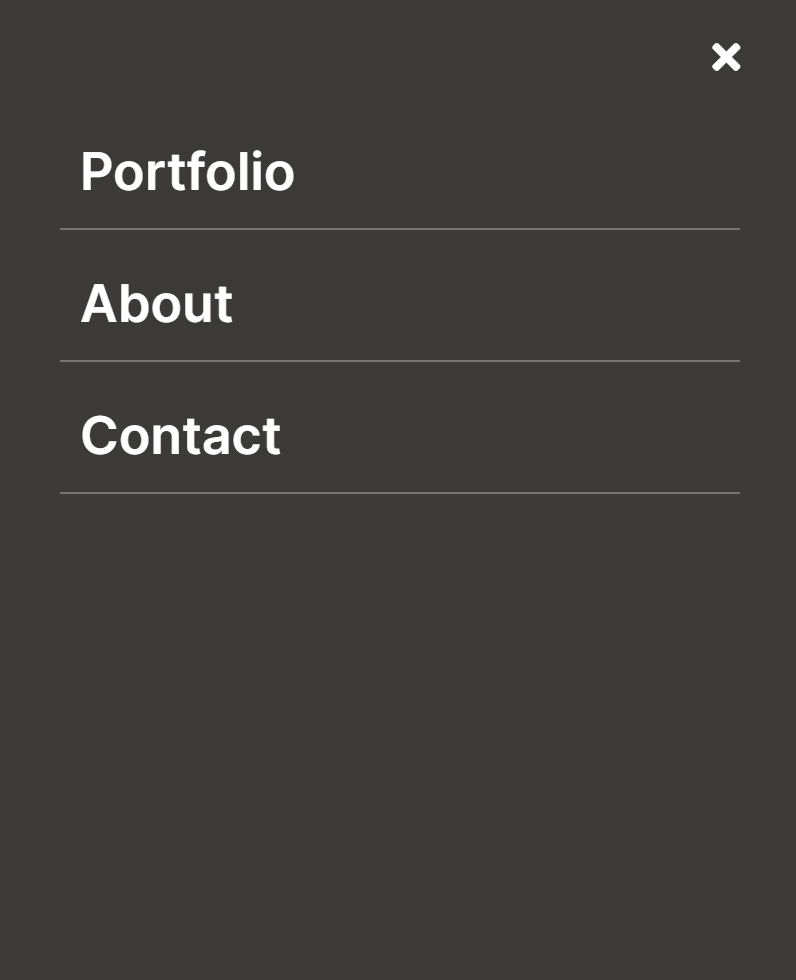

# Portfolio Project

> This project contains the portfolio worked on during the Microverse Code Reviewer Training.

> I worked on the Mobile Menu.

# Screenshot
## Mobile View

Width - 375px

# This project was built with:

HTML5

CSS3

Linters

# Version Control System

GIT

# 👤 Author

GitHub: [@dammyShittu](https://github.com/DammyShittu/)

Twitter: [@aded_shittu](https://twitter.com/aded_shittu/)

LinkedIn: [Adedamola Shittu](linkedin.com/in/adedamola-shittu-3ab465172/)

# 🤝 Contributing

Contributions, issues, and feature requests are welcome!

Feel free to check the issues page.

Show your support

Give a ⭐️ if you like this project!

# 📝 License

This project is [MIT](MIT.md) licensed.
